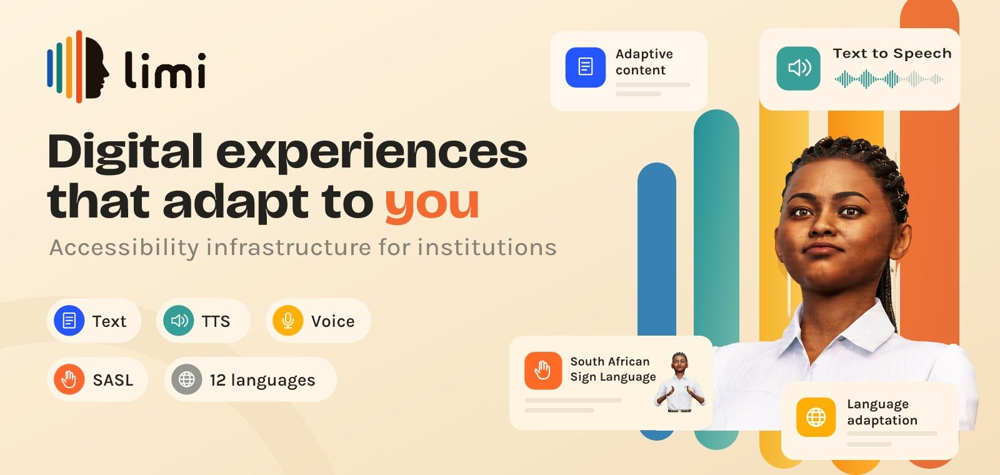

# Limi

**Digital experiences that adapt to you.**

Accessibility infrastructure for institutions.

## Capabilities

| | |
| --- | --- |
| **Adaptive content** | Interfaces that reshape themselves to fit each user. |
| **Text to Speech** | On-screen content read aloud. |
| **Voice** | Hands-free navigation and input. |
| **South African Sign Language** | SASL support for deaf and hard-of-hearing users. |
| **12 languages** | Multilingual delivery out of the box. |
| **Language adaptation** | Content that follows the language the user actually speaks. |
